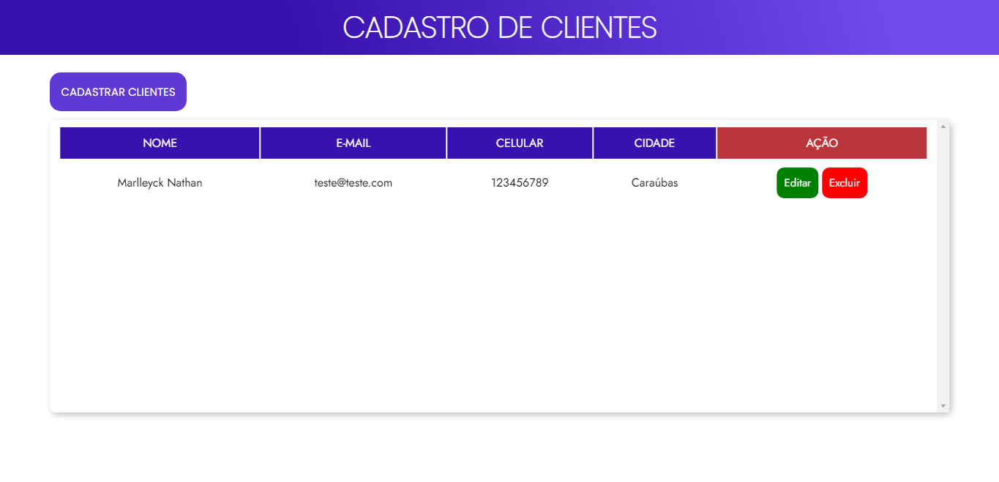

 <h1 align="center">CRUD-API</h1>

 
CRUD com HTML, CSS e JavaScript Vanilla. Utilizando API feita pela Jakeliny Gracielly da Rocketseat.

 
<a href="https://github.com/jakeliny/node-api-discover" target="_blank">Acesse aqui o repositório da API</a>

 
<a href="https://marlleyck.github.io/CRUD-API/" target="_blank">Acesse aqui o GITHUB Pages.</a>

 

